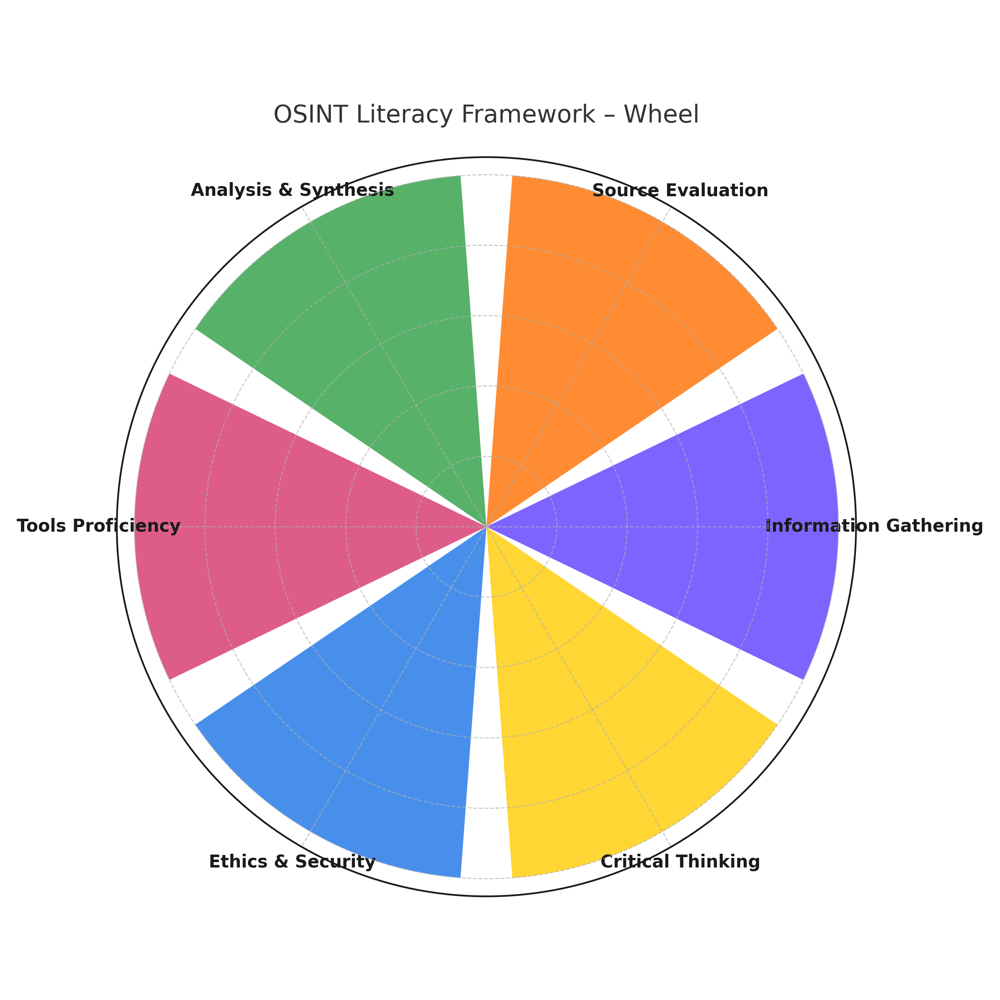

---

# 🗂️ OSINT Literacy Framework
MatrioscIA project
IHEMI. 
2024-2025
---

## 📥 Information Gathering
- Targeted queries on search engines (Google, Bing, dorks)  
- Use of social platforms, open databases, archives  
- Scraping tools & automated collection  
➡️ **Goal:** efficiently collect relevant open data  
🛠️ *Ex.* Google Advanced Search to find hidden PDFs  

---

## 🕵️ Source Evaluation & Verification
- Authenticity checks (images, videos, docs)  
- Critical evaluation of credibility  
- Cross-checking across different sources  
➡️ **Goal:** validate reliability of information  
🛠️ *Ex.* reverse image search to confirm photo origin  

---

## 📊 Information Analysis & Synthesis
- Graphs, timelines, maps for data analysis  
- Detect trends, links, anomalies  
- Visualization tools to extract patterns  
➡️ **Goal:** turn raw data into actionable intelligence  
🛠️ *Ex.* map suspicious entities & connections  

---

## ⚙️ Tools & Techniques Proficiency
- OSINT tools (Maltego, Shodan, SpiderFoot…)  
- Specialized platforms, APIs, automation  
- AI-assisted analysis  
➡️ **Goal:** optimize investigations with advanced tools  
🛠️ *Ex.* visualize Twitter relations with Maltego  

---

## 🔐 Ethics, Legality & Security (OPSEC)
- Legal frameworks (GDPR, copyright, ToS)  
- Digital security practices (VPN, anonymity)  
➡️ **Goal:** ensure safe, legal & ethical OSINT  
🛠️ *Ex.* secure browsing, verify content licenses  

---

## 🧠 Critical Thinking & Reflexivity
- Detect cognitive biases  
- Review & justify hypotheses  
- Transparency in methodology & results  
➡️ **Goal:** rigorous, critical, verifiable investigations  
🛠️ *Ex.* publish investigations with traceable sources 

*Wheel*


```mermaid
mindmap
  root((OSINT Literacy Framework))
    📥 OSINT Information Gathering
      Specific skills
        Targeted queries on search engines (Google, Bing) and specialized web
        Use of social platforms, public databases, open databases and online archives
        Scraping applications and automated collection tools
        Establish data archiving
      Description
        Ability to efficiently identify and collect relevant open data (text, images, metadata) using advanced search strategies (Boolean operators, filters, etc.).
      Examples
        Use Google Advanced or dorks to find hidden PDF documents
        Query social networks with relevant keywords
      Level
        Level 2 — Good proficiency
    🕵️ Source Evaluation & Verification
      Specific skills
        Authenticity check of information (images, videos, documents)
        Critical evaluation of source credibility and reliability
        Cross-checking data across different sources
      Description
        Evaluate the reliability of a source and confirm the authenticity of information (reverse image search, data triangulation, double-checking).
      Examples
        Verify a photo through a reverse image search to confirm its origin
        Cross-check public datasets to validate facts
      Level
        Level 2 — Good proficiency
    📊 Information Analysis & Synthesis
      Specific skills
        Analytical processing of data (graphs, timelines, maps)
        Detecting links, trends, and anomalies
        Using visualization tools to extract patterns
      Description
        Transform raw information into actionable intelligence by analysing data (trends, links, anomalies) and synthesizing results.
      Examples
        Cross-reference geographic data with socio-economic data to reveal trends
        Create a mind map of links between suspicious entities
      Level
        Level 2 — Good proficiency
    ⚙️ OSINT Tools & Techniques Proficiency
      Specific skills
        Use of OSINT tools (Maltego, Shodan, SpiderFoot...)
        Use of specialized platforms
        Automating collection and analysis
        A deliberate and well-managed use of artificial intelligence
      Description
        Know and effectively use tools (metadata analysis, geolocation, scripts, specialized engines) to optimize processes.
      Examples
        Automate Twitter feed collection via API
        Use Maltego to visualize relationships between accounts
      Level
        Level 2 — Good proficiency
    🔐 Ethics, Legality, and Security (OPSEC)
      Specific skills
        Knowledge of legal frameworks (GDPR, copyright)
        Digital security practises (VPN, anonymity)
        Compliance with terms of service
      Description
        Understand the legal and ethical implications of data collection and ensure protection of one’s identity and sources.
      Examples
        Use a VPN and secure browser during investigations
        Verify content licences before reuse
      Level
        Level 2 — Good proficiency
    🧠 Critical Thinking & Reflexivity
      Specific skills
        Detecting cognitive biases
        Critical analysis of hypotheses and reasoning
        Reflective review of process
        Clear, structured, and intelligible dissemination of investigative findings
      Description
        Go beyond surface appearances by questioning assumptions, identifying biases, and rigorously justifying reasoning. Analytical competence is demonstrated through the ability to explain the investigative process, articulate its significance, and acknowledge its potential limitations when presenting results.
      Examples
        Publish an investigation that explains the process and presents the traces found
        Allow the reader to verify the sources and data mentioned
      Level
        Level 3 — Critical capability
```
---

# 🙏 Acknowledgements

This study was supported by a grant from  
[IHEMI – Institut des Hautes Études du Ministère de l’Intérieur  
(Institute for Advanced Studies of the French Ministry of the Interior)](https://www.ihemi.fr)  
as part of the **MatrioscIA project**.

---

# 📧 Contacts & Slides

- ✉️ oledeuff@gmail.com  
- ✉️ rayya.roumanos@ijba.u-bordeaux-montaigne.fr  
- ✉️ thais.barbosa-de-almeida@u-bordeaux-montaigne.fr  

📂 Slides available 👉 [oledeuff.github.com/conferences](https://oledeuff.github.com/conferences)

---

# ✅ License

This work is licensed under:  

  
  

**Creative Commons Attribution (CC BY 4.0)**  
[https://creativecommons.org/licenses/by/4.0/](https://creativecommons.org/licenses/by/4.0/)
